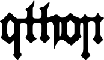
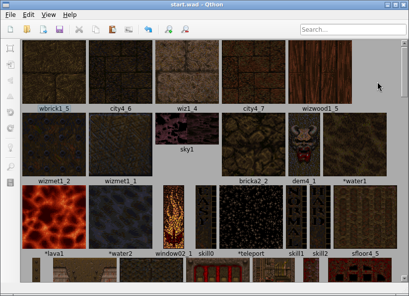

<p align="center">
  
</p>

<p align="center">A Qt-based WAD texture editor for Quake games.</p>

<p align="center"><em>A replacement for TexMex.</em></p>

<p align="center"></img></p>

## Features

- Open and edit WAD files
- Import PNG, JPG, JPEG images as textures
- Texture operations: flip, rotate, resize, rename
- Defullbright: remove fullbright colors from textures
- Export as WAD or individual images
- Supports both WAD2 (Quake) and WAD3 (Half-Life)
- Animated liquid texture preview

## Installation

Requires Python.

```bash
git clone https://github.com/tunalad/qthon.git
cd qthon
python build.py
```

The binary will be in the `dist` folder.

On Linux/macOS, you can also use `make install` after building (installs to `~/.local/bin`).


## Acknowledgments

[vgio](https://github.com/joshuaskelly/vgio) by Joshua Skelton - The backbone of this project. Handles reading and writing WAD2 and WAD3 files.

[Quake Fluids Explained](https://fdossena.com/?p=quakeFluids/i.md) by Federico Dossena - An in-depth article explaining how liquid animations work in Quake, including a demo which was adapted for the liquid texture preview.

[Fugue Icons](https://p.yusukekamiyamane.com/) by Yusuke Kamiyamane - A set of icons used throughout the interface.

## License

GNU General Public License v3.0
